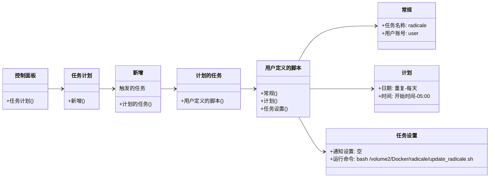

## 简介

<div style="text-align: center;">
  
</div>

> Docker-Radicale，CalDAV/CardDAV 服务器.
>
> Docker Hub：[tomsquest/docker-radicale](https://hub.docker.com/r/tomsquest/docker-radicale)
>
> Github：[docker-radicale](https://github.com/tomsquest/docker-radicale)
>

## Compose 配置

```yaml
version: "3.9"

services:
  radicale:
    image: tomsquest/docker-radicale:latest
    container_name: radicale
    ports:
      - "5232:5232"
    init: true
    security_opt:
      - no-new-privileges:true
    cap_drop:
      - ALL
    cap_add:
      - SETUID
      - SETGID
      - CHOWN
      - KILL
    deploy:
      resources:
        limits:
          memory: 256M
          pids: 50
    healthcheck:
      test: curl -f http://127.0.0.1:5232 || exit 1
      interval: 30s
      retries: 3
    restart: always
    environment:
      # 禁用容器尝试 chown 数据目录  // [!code warning]
      TAKE_FILE_OWNERSHIP: "false"  // [!code warning]
      UID: 1026
      GID: 100
    volumes:
      - /volume2/Docker/radicale/data:/data
```

::: note 配置提示

- 本方案禁用容器尝试 `chown` 数据目录，自定义详细配置参照 [Custom User/Group ID for the data volume](https://github.com/tomsquest/docker-radicale?tab=readme-ov-file#custom-usergroup-id-for-the-data-volume)

- 获取用户的UID、GID等信息，使用 `id <用户名>`

  ```bash{2}
  sa6400@SA6400:/$ id sa6400
  uid=1000(sa6400) gid=100(users) groups=100(users)
  ```

:::

## 配合 vCards CN 使用

::: info 项目地址：[metowolf/vCards](https://github.com/metowolf/vCards)

:::

::: tip [添加 CardDav 服务器 Radicale 输出格式的支持](https://github.com/metowolf/vCards/pull/232)，只需运行：

```bash
npm run-script radicale
```

:::

## 添加计划任务

**群晖**


