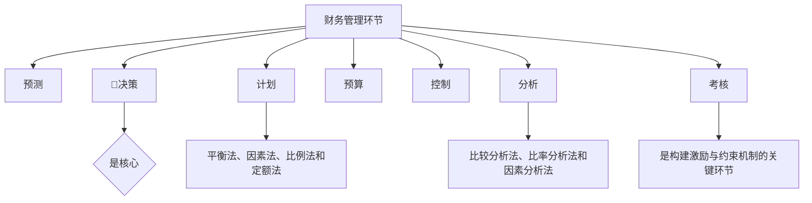

## 六、财务管理环节 ★

```mermaid
graph TD
    A[财务管理环节];
    A --> C[预测];
    A --> D[🔺决策];
    A --> E[计划];
    A --> F[预算];
    A --> G[控制];
    A --> H[分析];
    A --> I[考核];
    D --> B{是核心};
    E --> J[平衡法、因素法、比例法和定额法];
    H --> K[比较分析法、比率分析法和因素分析法];
    I --> L[是构建激励与约束机制的关键环节];
```

> [!note]
>
> 🔺**财务决策**
>
> ==经验判断==方法有：淘汰法、排队法、归类法；  
> ==定量==方法有：优选对比法、数学微分法、线性规划法、概率决策法等。

